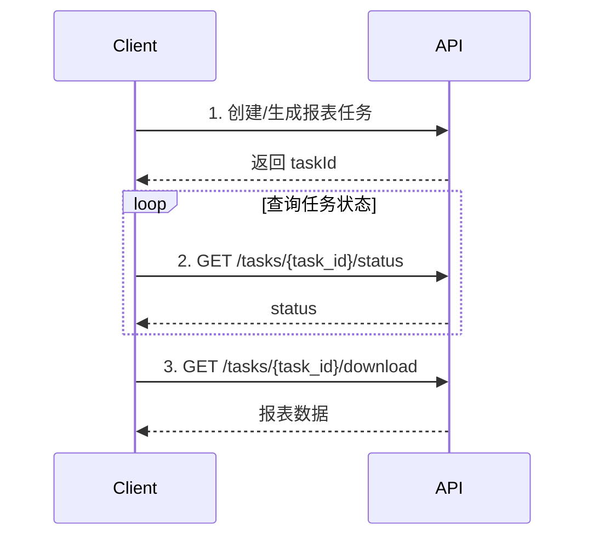

# Wildberries Reports API Documentation

整理来源：`reports.html.md`

本文档整理 Wildberries Reports 相关 API 的核心功能、请求参数、响应结构、调用限制与示例，方便开发集成使用。

## 基础信息

### Base URL

| API 类型 | Base URL |
| --- | --- |
| Statistics API | `https://statistics-api.wildberries.ru` |
| Seller Analytics API | `https://seller-analytics-api.wildberries.ru` |

### 鉴权

所有接口均使用 `HeaderApiKey` 鉴权。

| 接口分类 | Token 分类 |
| --- | --- |
| Main Reports | Statistics |
| 其他 Reports | Analytics |

### 通用错误响应

常见响应码：

| 状态码 | 含义 |
| --- | --- |
| 200 | 请求成功 |
| 204 | 无数据，通常出现在下载异步报表接口 |
| 400 | 请求参数错误 |
| 401 | 未授权或 Token 无效 |
| 402 | 需要付费或权限不足 |
| 403 | 拒绝访问，常见于部分扣款报表 |
| 404 | 资源不存在，常见于任务状态或下载接口 |
| 429 | 请求过于频繁，触发限流 |

---

## 目录

- [1. Main Reports](#1-main-reports)
  - [1.1 库存报表 Deprecated](#11-库存报表-deprecated)
  - [1.2 订单报表](#12-订单报表)
  - [1.3 销售报表](#13-销售报表)
- [2. Warehouses Inventory Report](#2-warehouses-inventory-report)
- [3. Report on Items with Mandatory Labeling](#3-report-on-items-with-mandatory-labeling)
- [4. Retention Reports](#4-retention-reports)
- [5. Acceptance Expenses](#5-acceptance-expenses)
- [6. Paid Storage](#6-paid-storage)
- [7. Sales by Regions](#7-sales-by-regions)
- [8. Share of Brand in Sales](#8-share-of-brand-in-sales)
- [9. Hidden Items](#9-hidden-items)
- [10. Returns and Item Movement Report](#10-returns-and-item-movement-report)

---

# 1. Main Reports

> Token 分类：`Statistics`

主报表接口支持导出 Excel。订单与销售数据每 30 分钟更新一次，数据保存时间最多为销售日期后的 90 天。

## 1.1 库存报表 Deprecated

获取商品库存信息。

> 注意：该接口已废弃，官方说明将移除。

### Endpoint

```http
GET https://statistics-api.wildberries.ru/api/v1/supplier/stocks
```

### 请求参数

| 参数 | 位置 | 类型 | 必填 | 说明 |
| --- | --- | --- | --- | --- |
| `dateFrom` | query | string `<date-time>` | 是 | 商品最后变更时间。若需获取全部库存，可传入较早日期。格式为 RFC3339，可传日期或日期时间，时间为莫斯科时区 UTC+3。示例：`2019-06-20`、`2019-06-20T23:59:59`、`2019-06-20T00:00:00.12345` |

### 限流

| Token 类型 | 周期 | 限制 | 间隔 | Burst |
| --- | --- | --- | --- | --- |
| Personal | 1 min | 1 request | 1 min | 10 requests |
| Service | 1 min | 1 request | 1 min | 10 requests |
| Base with secret | 1 min | 1 request | 1 min | 10 requests |
| Base | 3 h | 1 request | 3 h | 1 request |

### 响应

| 状态码 | 说明 |
| --- | --- |
| 200 | 成功，返回库存数组 |
| 400 | Bad request |
| 401 | Unauthorized |
| 402 | Payment required |
| 429 | Too many requests |

### 200 响应示例

```json
[
  {
    "lastChangeDate": "2023-07-05T11:13:35",
    "warehouseName": "Краснодар",
    "supplierArticle": "443284",
    "nmId": 1439871458,
    "barcode": "2037401340280",
    "quantity": 33,
    "inWayToClient": 1,
    "inWayFromClient": 0,
    "quantityFull": 34,
    "category": "Посуда и инвентарь",
    "subject": "Формы для запекания",
    "brand": "X",
    "techSize": "0",
    "Price": 185,
    "Discount": 0,
    "isSupply": true,
    "isRealization": false,
    "SCCode": "Tech"
  }
]
```

---

## 1.2 订单报表

返回订单信息。1 行代表 1 个订单中的 1 个商品，应使用 `srid` 字段识别订单。

### Endpoint

```http
GET https://statistics-api.wildberries.ru/api/v1/supplier/orders
```

### 重要说明

- 数据每 30 分钟更新一次。
- 数据最多保存销售日期后 90 天。
- 响应不包含未确认付款的订单，例如延迟支付或分期支付订单。
- 当 `flag=0` 或未传 `flag` 时，单次响应约限制为 80,000 行。
- 若需分页获取全部订单，下一次请求应将上一批响应最后一行的完整 `lastChangeDate` 作为 `dateFrom`。
- 若返回空数组 `[]`，表示数据已全部获取。

### 请求参数

| 参数 | 位置 | 类型 | 必填 | 默认值 | 说明 |
| --- | --- | --- | --- | --- | --- |
| `dateFrom` | query | string `<date-time>` | 是 | - | 订单最后变更时间。RFC3339 格式，可传日期或日期时间，时间为莫斯科时区 UTC+3。 |
| `flag` | query | integer | 否 | `0` | `0`：返回 `lastChangeDate >= dateFrom` 的数据；`1`：返回与 `dateFrom` 日期相同的全部订单，忽略时间部分。 |

### 限流

| Token 类型 | 周期 | 限制 | 间隔 | Burst |
| --- | --- | --- | --- | --- |
| Personal | 1 min | 1 request | 1 min | 10 requests |
| Service | 1 min | 1 request | 1 min | 10 requests |
| Base with secret | 1 min | 1 request | 1 min | 10 requests |
| Base | 3 h | 1 request | 3 h | 1 request |

### 响应

| 状态码 | 说明 |
| --- | --- |
| 200 | 成功，返回订单数组 |
| 400 | Bad request |
| 401 | Unauthorized |
| 402 | Payment required |
| 429 | Too many requests |

### 200 响应示例

```json
[
  {
    "date": "2022-03-04T18:08:31",
    "lastChangeDate": "2022-03-06T10:11:07",
    "warehouseName": "Подольск",
    "warehouseType": "Склад продавца",
    "countryName": "Россия",
    "oblastOkrugName": "Центральный федеральный округ",
    "regionName": "Московская",
    "supplierArticle": "12345",
    "nmId": 1234567,
    "barcode": "123453559000",
    "category": "Бытовая техника",
    "subject": "Мультистайлеры",
    "brand": "Тест",
    "techSize": "0",
    "incomeID": 56735459,
    "isSupply": false,
    "isRealization": true,
    "totalPrice": 1887,
    "discountPercent": 18,
    "spp": 26,
    "finishedPrice": 1145,
    "priceWithDisc": 1547,
    "isCancel": true,
    "cancelDate": "2022-03-09T00:00:00",
    "sticker": "926912515",
    "gNumber": "34343462218572569531",
    "srid": "11.rf9ef11fce1684117b0nhj96222982382.3.0"
  }
]
```

---

## 1.3 销售报表

返回销售和退货信息。1 行代表 1 次销售或退货中的 1 个商品，应使用 `srid` 字段识别订单。

### Endpoint

```http
GET https://statistics-api.wildberries.ru/api/v1/supplier/sales
```

### 重要说明

- 数据每 30 分钟更新一次。
- 数据最多保存销售日期后 90 天。
- 该报表为运营监控使用的预估数据，不建议用于精确财务核算。
- 不包含付款未确认的订单。
- `priceWithDisc`、`forPay` 等字段采用简化逻辑，可能与财务实现报表存在差异。
- `finishedPrice`、`priceWithDisc`、`forPay` 可能临时为 `0`，数据通常会在 24 小时内异步补齐。
- 当 `flag=0` 或未传 `flag` 时，单次响应约限制为 80,000 行。分页方式与订单报表相同。

### 请求参数

| 参数 | 位置 | 类型 | 必填 | 默认值 | 说明 |
| --- | --- | --- | --- | --- | --- |
| `dateFrom` | query | string `<date-time>` | 是 | - | 销售或退货最后变更时间。RFC3339 格式，可传日期或日期时间，时间为莫斯科时区 UTC+3。 |
| `flag` | query | integer | 否 | `0` | `0`：返回 `lastChangeDate >= dateFrom` 的数据；`1`：返回与 `dateFrom` 日期相同的全部销售或退货，忽略时间部分。 |

### 限流

| Token 类型 | 周期 | 限制 | 间隔 | Burst |
| --- | --- | --- | --- | --- |
| Personal | 1 min | 1 request | 1 min | 1 request |
| Service | 1 min | 1 request | 1 min | 1 request |
| Base with secret | 1 min | 1 request | 1 min | 1 request |
| Base | 2 h | 1 request | 2 h | 1 request |

### 响应

| 状态码 | 说明 |
| --- | --- |
| 200 | 成功，返回销售/退货数组 |
| 400 | Bad request |
| 401 | Unauthorized |
| 402 | Payment required |
| 429 | Too many requests |

### 200 响应示例

```json
[
  {
    "date": "2022-03-04T18:08:31",
    "lastChangeDate": "2022-03-06T10:11:07",
    "warehouseName": "Подольск",
    "warehouseType": "Склад продавца",
    "countryName": "Россия",
    "oblastOkrugName": "Центральный федеральный округ",
    "regionName": "Московская",
    "supplierArticle": "12345",
    "nmId": 1234567,
    "barcode": "123453559000",
    "category": "Бытовая техника",
    "subject": "Мультистайлеры",
    "brand": "Тест",
    "techSize": "0",
    "incomeID": 56735459,
    "isSupply": false,
    "isRealization": true,
    "totalPrice": 1887,
    "discountPercent": 18,
    "spp": 20,
    "paymentSaleAmount": 93,
    "forPay": 1284.01,
    "finishedPrice": 1145,
    "priceWithDisc": 1547,
    "saleID": "S9993700024",
    "sticker": "926912515",
    "gNumber": "34343462218572569531",
    "srid": "11.rf9ef11fce1684117b0nhj96222982382.3.0"
  }
]
```

---

# 2. Warehouses Inventory Report

> Token 分类：`Analytics`

用于获取 WB 仓库库存剩余报表。该报表为异步生成流程：

1. 创建报表任务。
2. 轮询任务状态。
3. 任务完成后下载报表。

生成完成的报表保留 2 小时。

## 2.1 创建库存剩余报表任务

### Endpoint

```http
GET https://seller-analytics-api.wildberries.ru/api/v1/warehouse_remains
```

### 请求参数

| 参数 | 位置 | 类型 | 必填 | 默认值 | 说明 |
| --- | --- | --- | --- | --- | --- |
| `locale` | query | string | 否 | `ru` | `subjectName` 与 `warehouseName` 的语言。可选：`ru`、`en`、`zh`。`warehouseName` 英文值为英文。 |
| `groupByBrand` | query | boolean | 否 | `false` | 按品牌分组。 |
| `groupBySubject` | query | boolean | 否 | `false` | 按子类目分组。 |
| `groupBySa` | query | boolean | 否 | `false` | 按卖家货号分组。 |
| `groupByNm` | query | boolean | 否 | `false` | 按 WB 商品编号分组。若为 `true`，响应包含 `volume` 字段。 |
| `groupByBarcode` | query | boolean | 否 | `false` | 按条码分组。 |
| `groupBySize` | query | boolean | 否 | `false` | 按尺码分组。 |
| `filterPics` | query | integer | 否 | `0` | 图片过滤：`-1` 无图片，`0` 不过滤，`1` 有图片。 |
| `filterVolume` | query | integer | 否 | `0` | 体积过滤：`-1` 无尺寸，`0` 不过滤，`3` 大于 3 升。 |

### 限流

| Token 类型 | 周期 | 限制 | 间隔 | Burst |
| --- | --- | --- | --- | --- |
| Personal | 1 min | 1 request | 1 min | 5 requests |
| Service | 1 min | 1 request | 1 min | 5 requests |
| Base with secret | 1 min | 1 request | 1 min | 5 requests |
| Base | 1 h | 4 requests | 15 min | 1 request |

### 响应

| 状态码 | 说明 |
| --- | --- |
| 200 | 成功，返回任务 ID |
| 400 | Bad request |
| 401 | Unauthorized |
| 402 | Payment required |
| 429 | Too many requests |

### 200 响应示例

```json
{
  "data": {
    "taskId": "219eaecf-e532-4bd8-9f15-8036ec1b042d"
  }
}
```

## 2.2 查询库存剩余报表任务状态

### Endpoint

```http
GET https://seller-analytics-api.wildberries.ru/api/v1/warehouse_remains/tasks/{task_id}/status
```

### 请求参数

| 参数 | 位置 | 类型 | 必填 | 说明 |
| --- | --- | --- | --- | --- |
| `task_id` | path | string | 是 | 报表生成任务 ID。 |

### 限流

| Token 类型 | 周期 | 限制 | 间隔 | Burst |
| --- | --- | --- | --- | --- |
| Personal | 5 s | 1 request | 5 s | 5 requests |
| Service | 5 s | 1 request | 5 s | 5 requests |
| Base with secret | 5 s | 1 request | 5 s | 5 requests |
| Base | 1 h | 4 requests | 15 min | 1 request |

### 响应

| 状态码 | 说明 |
| --- | --- |
| 200 | 成功，返回任务状态 |
| 400 | Bad request |
| 401 | Unauthorized |
| 404 | Not found |
| 429 | Too many requests |

### 200 响应示例

```json
{
  "data": {
    "id": "cad56ec5-91ec-43a2-b5e8-efcf244cf309",
    "status": "done"
  }
}
```

## 2.3 下载库存剩余报表

### Endpoint

```http
GET https://seller-analytics-api.wildberries.ru/api/v1/warehouse_remains/tasks/{task_id}/download
```

### 请求参数

| 参数 | 位置 | 类型 | 必填 | 说明 |
| --- | --- | --- | --- | --- |
| `task_id` | path | string | 是 | 报表生成任务 ID。 |

### 响应

| 状态码 | 说明 |
| --- | --- |
| 200 | 成功，返回报表数组 |
| 204 | 无数据 |
| 400 | Bad request |
| 401 | Unauthorized |
| 402 | Payment required |
| 404 | Not found |
| 429 | Too many requests |

### 200 响应示例

```json
[
  {
    "brand": "Wonderful",
    "subjectName": "Фотоальбомы",
    "vendorCode": "41058/прозрачный",
    "nmId": 183804172,
    "barcode": "2037031652319",
    "techSize": "0",
    "volume": 1.33,
    "warehouses": [
      {
        "warehouseName": "В пути до получателей",
        "quantity": 14
      },
      {
        "warehouseName": "Всего находится на складах",
        "quantity": 267
      }
    ]
  }
]
```

---

# 3. Report on Items with Mandatory Labeling

> Token 分类：`Analytics`

返回带有强制标记商品的操作记录。

## 3.1 强制标记商品报表

### Endpoint

```http
POST https://seller-analytics-api.wildberries.ru/api/v1/analytics/excise-report
```

### Query 参数

| 参数 | 位置 | 类型 | 必填 | 说明 |
| --- | --- | --- | --- | --- |
| `dateFrom` | query | string | 是 | 报表开始日期，格式：`YYYY-MM-DD`。 |
| `dateTo` | query | string | 是 | 报表结束日期，格式：`YYYY-MM-DD`。 |

### Request Body

Content-Type：`application/json`

| 字段 | 类型 | 必填 | 说明 |
| --- | --- | --- | --- |
| `countries` | string[] | 否 | 国家代码，符合 ISO 3166-2。可选：`AM`、`BY`、`KG`、`KZ`、`RU`、`UZ`。传空则不按国家过滤。 |

### 请求示例

```json
{
  "countries": ["AM", "RU"]
}
```

### 限流

| Token 类型 | 周期 | 限制 | 间隔 | Burst |
| --- | --- | --- | --- | --- |
| Personal | 5 h | 10 requests | 30 min | 10 requests |
| Service | 5 h | 10 requests | 30 min | 10 requests |
| Base with secret | 5 h | 10 requests | 30 min | 10 requests |
| Base | 24 h | 2 requests | 12 h | 1 request |

### 响应

| 状态码 | 说明 |
| --- | --- |
| 200 | 成功 |
| 400 | Bad request |
| 401 | Unauthorized |
| 402 | Payment required |
| 429 | Too many requests |

### 200 响应示例

```json
{
  "response": {
    "data": [
      {
        "name": "Россия",
        "price": 100,
        "currency_name_short": "AMD",
        "excise_short": "0102900254680370215_Re/=lSbNiGD",
        "barcode": "2038893425820",
        "nm_id": 169085355,
        "operation_type_id": 1,
        "fiscal_doc_number": 12345678,
        "fiscal_dt": "2024-01-01",
        "fiscal_drive_number": "string",
        "rid": 606217433440,
        "srid": "7513432034713632943.1.0"
      }
    ]
  }
}
```

---

# 4. Retention Reports

> Token 分类：`Analytics`

扣款类报表，包含尺寸罚款、仓库测量、调包/错投、自购扣款、缺少强制标记等。

## 4.1 物流和仓储费用倍率报表

返回物流和仓储费用倍率相关扣款报表。

### Endpoint

```http
GET https://seller-analytics-api.wildberries.ru/api/analytics/v1/measurement-penalties
```

### 请求参数

| 参数 | 位置 | 类型 | 必填 | 默认值 | 说明 |
| --- | --- | --- | --- | --- | --- |
| `dateFrom` | query | string `<date-time>` | 否 | 数据首次接收时间 | 报表开始时间。示例：`2025-02-01T15:00:00Z`。 |
| `dateTo` | query | string `<date-time>` | 是 | - | 报表结束时间。 |
| `limit` | query | integer `<=1000` | 是 | - | 返回扣款记录数量。 |
| `offset` | query | integer | 否 | `0` | 跳过记录数。 |

### 限流

| Token 类型 | 周期 | 限制 | 间隔 | Burst |
| --- | --- | --- | --- | --- |
| Personal | 1 min | 1 request | 1 min | 1 request |
| Service | 1 min | 1 request | 1 min | 1 request |
| Base with secret | 1 min | 1 request | 1 min | 1 request |
| Base | 6 h | 1 request | 6 h | 1 request |

### 响应

| 状态码 | 说明 |
| --- | --- |
| 200 | 成功 |
| 400 | Bad request |
| 401 | Unauthorized |
| 402 | Payment required |
| 403 | Access denied |
| 429 | Too many requests |

### 200 响应结构示例

```json
{
  "data": {
    "reports": [
      {
        "nmId": 9234567890,
        "subjectName": "Костюмы спортивные",
        "dimId": 98151405,
        "prcOver": 130.71,
        "volume": 6.47,
        "width": 7,
        "length": 28,
        "height": 33,
        "volumeSup": 4.95,
        "widthSup": 30,
        "lengthSup": 33,
        "heightSup": 5,
        "photoUrls": ["https://example.com/photo.webp"],
        "dtBonus": "2025-06-02T00:00:00Z",
        "isValid": true,
        "isValidDt": "2025-05-29T13:35:57Z",
        "reversalAmount": 0,
        "penaltyAmount": 449.83
      }
    ],
    "total": 3
  }
}
```

## 4.2 仓库测量报表

返回仓库测量结果报表。

### Endpoint

```http
GET https://seller-analytics-api.wildberries.ru/api/analytics/v1/warehouse-measurements
```

### 请求参数

| 参数 | 位置 | 类型 | 必填 | 默认值 | 说明 |
| --- | --- | --- | --- | --- | --- |
| `dateFrom` | query | string `<date-time>` | 否 | 数据首次接收时间 | 报表开始时间。 |
| `dateTo` | query | string `<date-time>` | 是 | - | 报表结束时间。 |
| `limit` | query | integer `<=1000` | 是 | - | 返回测量记录数量。 |
| `offset` | query | integer | 否 | `0` | 跳过记录数。 |

### 限流

| Token 类型 | 周期 | 限制 | 间隔 | Burst |
| --- | --- | --- | --- | --- |
| Personal | 1 min | 1 request | 1 min | 1 request |
| Service | 1 min | 1 request | 1 min | 1 request |
| Base with secret | 1 min | 1 request | 1 min | 1 request |
| Base | 6 h | 1 request | 6 h | 1 request |

### 响应

| 状态码 | 说明 |
| --- | --- |
| 200 | 成功 |
| 400 | Bad request |
| 401 | Unauthorized |
| 402 | Payment required |
| 403 | Access denied |
| 429 | Too many requests |

### 200 响应结构示例

```json
{
  "data": {
    "reports": [
      {
        "nmId": 9234567089,
        "subjectName": "Чемоданы",
        "dimId": 4983331,
        "volume": 16.25,
        "width": 26,
        "length": 25,
        "height": 25,
        "photoUrls": ["https://example.com/photo.jpg"],
        "dt": "2025-06-05T00:00:00Z"
      }
    ],
    "total": 2
  }
}
```

## 4.3 调包和错投扣款报表

返回调包和错误附件相关扣款报表。

### Endpoint

```http
GET https://seller-analytics-api.wildberries.ru/api/analytics/v1/deductions
```

### 请求参数

| 参数 | 位置 | 类型 | 必填 | 默认值 | 说明 |
| --- | --- | --- | --- | --- | --- |
| `dateFrom` | query | string `<date-time>` | 否 | 数据首次接收时间 | 报表开始时间。 |
| `dateTo` | query | string `<date-time>` | 是 | - | 报表结束时间。 |
| `sort` | query | string | 否 | `dtBonus` | 排序字段：`nmId`、`dtBonus`、`bonusSumm`。 |
| `order` | query | string | 否 | `desc` | 排序方向：`desc`、`asc`。 |
| `limit` | query | integer `<=1000` | 是 | - | 返回扣款记录数量。 |
| `offset` | query | integer | 否 | `0` | 跳过记录数。 |

### 限流

| Token 类型 | 周期 | 限制 | 间隔 | Burst |
| --- | --- | --- | --- | --- |
| Personal | 1 min | 1 request | 1 min | 1 request |
| Service | 1 min | 1 request | 1 min | 1 request |
| Base with secret | 1 min | 1 request | 1 min | 1 request |
| Base | 1 h | 4 requests | 15 min | 1 request |

### 响应

| 状态码 | 说明 |
| --- | --- |
| 200 | 成功 |
| 400 | Bad request |
| 401 | Unauthorized |
| 402 | Payment required |
| 403 | Access denied |
| 429 | Too many requests |

### 200 响应结构示例

```json
{
  "data": {
    "reports": [
      {
        "dtBonus": "2025-06-02T00:00:00Z",
        "nmId": 544454,
        "oldShkId": 26624352356,
        "oldColor": "темно-синий,голубой",
        "oldSize": "A",
        "oldSku": "54532562",
        "oldVendorCode": "23535 Стемпинг 500",
        "newShkId": 123333223,
        "newColor": "темно-синий,голубой",
        "newSize": "A",
        "newSku": "12323332223",
        "newVendorCode": "wh-service-podmena",
        "bonusSumm": 247.5,
        "bonusType": "Подмена FBW",
        "photoUrls": ["https://example.com/photo.webp"]
      }
    ],
    "total": 11
  }
}
```

## 4.4 自购扣款报表

返回自购扣款报表。报表每周三 UTC+4 07:00 生成，包含每周数据，也可获取自 2023 年 8 月以来的全部数据。

### Endpoint

```http
GET https://seller-analytics-api.wildberries.ru/api/v1/analytics/antifraud-details
```

### 请求参数

| 参数 | 位置 | 类型 | 必填 | 说明 |
| --- | --- | --- | --- | --- |
| `date` | query | string | 否 | 报表周期内日期，格式：`YYYY-MM-DD`。例如：`2023-12-01`。不传则获取自 2023 年 8 月以来的全部数据。 |

### 限流

| Token 类型 | 周期 | 限制 | 间隔 | Burst |
| --- | --- | --- | --- | --- |
| Personal | 10 min | 1 request | 10 min | 10 requests |
| Service | 10 min | 1 request | 10 min | 10 requests |
| Base with secret | 10 min | 1 request | 10 min | 10 requests |
| Base | 1 h | 1 request | 1 h | 1 request |

### 响应

| 状态码 | 说明 |
| --- | --- |
| 200 | 成功，返回自购扣款详情 |
| 400 | Bad request |
| 401 | Unauthorized |
| 402 | Payment required |
| 429 | Too many requests |

### 200 响应示例

```json
{
  "details": [
    {
      "nmID": 123456789,
      "sum": 3540,
      "currency": "RUB",
      "dateFrom": "2023-08-23",
      "dateTo": "2023-08-29"
    }
  ]
}
```

## 4.5 商品缺少强制标记扣款报表

返回因缺少强制商品标记产生的扣款报表，包含标记缺失或无法读取的商品照片。最多可获取 31 天数据，自 2024 年 3 月开始可查。

### Endpoint

```http
GET https://seller-analytics-api.wildberries.ru/api/v1/analytics/goods-labeling
```

### 请求参数

| 参数 | 位置 | 类型 | 必填 | 说明 |
| --- | --- | --- | --- | --- |
| `dateFrom` | query | string `<date>` | 是 | 报表开始日期，格式：`YYYY-MM-DD`。 |
| `dateTo` | query | string `<date>` | 是 | 报表结束日期，格式：`YYYY-MM-DD`。 |

### 限流

| Token 类型 | 周期 | 限制 | 间隔 | Burst |
| --- | --- | --- | --- | --- |
| Personal | 1 min | 1 request | 1 min | 10 requests |
| Service | 1 min | 1 request | 1 min | 10 requests |
| Base with secret | 1 min | 1 request | 1 min | 10 requests |
| Base | 1 h | 1 request | 1 h | 1 request |

### 响应

| 状态码 | 说明 |
| --- | --- |
| 200 | 成功 |
| 400 | Bad request |
| 401 | Unauthorized |
| 402 | Payment required |
| 429 | Too many requests |

### 200 响应示例

```json
{
  "report": [
    {
      "amount": 1500,
      "date": "2024-03-26T01:00:00Z",
      "incomeId": 18484008,
      "nmID": 49434732,
      "photoUrls": ["https://example.com/photo.jpg"],
      "shkID": 17346434621,
      "sku": "4630153500834"
    }
  ]
}
```

---

# 5. Acceptance Expenses

> Token 分类：`Analytics`

获取验收费用报表。异步生成流程：创建任务 → 查询状态 → 下载报表。生成完成的报表保留 2 小时。

## 5.1 创建验收费用报表任务

### Endpoint

```http
GET https://seller-analytics-api.wildberries.ru/api/v1/acceptance_report
```

### 请求参数

| 参数 | 位置 | 类型 | 必填 | 说明 |
| --- | --- | --- | --- | --- |
| `dateFrom` | query | string | 是 | 报表开始日期，格式：`YYYY-MM-DD`。 |
| `dateTo` | query | string | 是 | 报表结束日期，格式：`YYYY-MM-DD`。 |

> 最大报表周期：31 天。

### 限流

| Token 类型 | 周期 | 限制 | 间隔 | Burst |
| --- | --- | --- | --- | --- |
| Personal | 1 min | 1 request | 1 min | 1 request |
| Service | 1 min | 1 request | 1 min | 1 request |
| Base with secret | 1 min | 1 request | 1 min | 1 request |
| Base | 3 h | 1 request | 3 h | 1 request |

### 响应

| 状态码 | 说明 |
| --- | --- |
| 200 | 成功，返回任务 ID |
| 400 | Bad request |
| 401 | Unauthorized |
| 402 | Payment required |
| 429 | Too many requests |

### 200 响应示例

```json
{
  "data": {
    "taskId": "219eaecf-e532-4bd8-9f15-8036ec1b042d"
  }
}
```

## 5.2 查询验收费用报表任务状态

### Endpoint

```http
GET https://seller-analytics-api.wildberries.ru/api/v1/acceptance_report/tasks/{task_id}/status
```

### 请求参数

| 参数 | 位置 | 类型 | 必填 | 说明 |
| --- | --- | --- | --- | --- |
| `task_id` | path | string | 是 | 报表生成任务 ID。 |

### 限流

| Token 类型 | 周期 | 限制 | 间隔 | Burst |
| --- | --- | --- | --- | --- |
| Personal | 5 s | 1 request | 5 s | 1 request |
| Service | 5 s | 1 request | 5 s | 1 request |
| Base with secret | 5 s | 1 request | 5 s | 1 request |
| Base | 1 h | 2 requests | 30 min | 1 request |

### 响应

| 状态码 | 说明 |
| --- | --- |
| 200 | 成功，返回任务状态 |
| 400 | Bad request |
| 401 | Unauthorized |
| 404 | Not found |
| 429 | Too many requests |

### 200 响应示例

```json
{
  "data": {
    "id": "cad56ec5-91ec-43a2-b5e8-efcf244cf309",
    "status": "done"
  }
}
```

## 5.3 下载验收费用报表

### Endpoint

```http
GET https://seller-analytics-api.wildberries.ru/api/v1/acceptance_report/tasks/{task_id}/download
```

### 请求参数

| 参数 | 位置 | 类型 | 必填 | 说明 |
| --- | --- | --- | --- | --- |
| `task_id` | path | string | 是 | 报表生成任务 ID。 |

### 响应

| 状态码 | 说明 |
| --- | --- |
| 200 | 成功，返回报表数组 |
| 204 | 无数据 |
| 400 | Bad request |
| 401 | Unauthorized |
| 402 | Payment required |
| 404 | Not found |
| 429 | Too many requests |

### 200 响应示例

```json
[
  {
    "count": 40,
    "giCreateDate": "2025-03-04",
    "incomeId": 11834106,
    "nmID": 123456789,
    "shkCreateDate": "2025-03-14",
    "subjectName": "Добавки пищевые",
    "total": 873.04
  }
]
```

---

# 6. Paid Storage

> Token 分类：`Analytics`

获取付费仓储报表。异步生成流程：生成任务 → 查询状态 → 下载报表。生成完成的报表可用 2 小时。

## 6.1 生成付费仓储报表任务

### Endpoint

```http
GET https://seller-analytics-api.wildberries.ru/api/v1/paid_storage
```

### 请求参数

| 参数 | 位置 | 类型 | 必填 | 说明 |
| --- | --- | --- | --- | --- |
| `dateFrom` | query | string | 是 | 报表开始时间，RFC3339 格式，可传日期或日期时间。 |
| `dateTo` | query | string | 是 | 报表结束时间，RFC3339 格式，可传日期或日期时间。 |

> 最大报表周期：8 天。

### 限流

| Token 类型 | 周期 | 限制 | 间隔 | Burst |
| --- | --- | --- | --- | --- |
| Personal | 1 min | 1 request | 1 min | 5 requests |
| Service | 1 min | 1 request | 1 min | 5 requests |
| Base with secret | 1 min | 1 request | 1 min | 5 requests |
| Base | 1 h | 1 request | 1 h | 1 request |

### 响应

| 状态码 | 说明 |
| --- | --- |
| 200 | 成功，返回任务 ID |
| 400 | Bad request |
| 401 | Unauthorized |
| 402 | Payment required |
| 429 | Too many requests |

### 200 响应示例

```json
{
  "data": {
    "taskId": "219eaecf-e532-4bd8-9f15-8036ec1b042d"
  }
}
```

## 6.2 查询付费仓储报表任务状态

### Endpoint

```http
GET https://seller-analytics-api.wildberries.ru/api/v1/paid_storage/tasks/{task_id}/status
```

### 请求参数

| 参数 | 位置 | 类型 | 必填 | 说明 |
| --- | --- | --- | --- | --- |
| `task_id` | path | string | 是 | 任务 ID。 |

### 限流

| Token 类型 | 周期 | 限制 | 间隔 | Burst |
| --- | --- | --- | --- | --- |
| Personal | 5 s | 1 request | 5 s | 5 requests |
| Service | 5 s | 1 request | 5 s | 5 requests |
| Base with secret | 5 s | 1 request | 5 s | 5 requests |
| Base | 1 h | 2 requests | 30 min | 2 requests |

### 响应

| 状态码 | 说明 |
| --- | --- |
| 200 | 成功，返回任务状态 |
| 400 | Bad request |
| 401 | Unauthorized |
| 404 | Not found |
| 429 | Too many requests |

### 200 响应示例

```json
{
  "data": {
    "id": "cad56ec5-91ec-43a2-b5e8-efcf244cf309",
    "status": "done"
  }
}
```

## 6.3 下载付费仓储报表

### Endpoint

```http
GET https://seller-analytics-api.wildberries.ru/api/v1/paid_storage/tasks/{task_id}/download
```

### 请求参数

| 参数 | 位置 | 类型 | 必填 | 说明 |
| --- | --- | --- | --- | --- |
| `task_id` | path | string | 是 | 任务 ID。 |

### 响应

| 状态码 | 说明 |
| --- | --- |
| 200 | 成功，返回报表数组 |
| 204 | 无数据 |
| 400 | Bad request |
| 401 | Unauthorized |
| 402 | Payment required |
| 404 | Not found |
| 429 | Too many requests |

### 200 响应示例

```json
[
  {
    "date": "2023-10-01",
    "logWarehouseCoef": 1,
    "officeId": 507,
    "warehouse": "Коледино",
    "warehouseCoef": 1.7,
    "giId": 123456,
    "chrtId": 1234567,
    "size": "0",
    "barcode": "",
    "subject": "Маски одноразовые",
    "brand": "1000 Каталог",
    "vendorCode": "567383",
    "nmId": 1234567,
    "volume": 12,
    "calcType": "короба: без габаритов",
    "warehousePrice": 7.65,
    "barcodesCount": 1,
    "palletPlaceCode": 0,
    "palletCount": 0,
    "originalDate": "2023-03-01",
    "loyaltyDiscount": 10,
    "tariffFixDate": "2023-10-01",
    "tariffLowerDate": "2023-11-01"
  }
]
```

---

# 7. Sales by Regions

> Token 分类：`Analytics`

返回按国家地区分组的销售数据。单次请求最多获取 31 天报表。

## 7.1 地区销售报表

### Endpoint

```http
GET https://seller-analytics-api.wildberries.ru/api/v1/analytics/region-sale
```

### 请求参数

| 参数 | 位置 | 类型 | 必填 | 说明 |
| --- | --- | --- | --- | --- |
| `dateFrom` | query | string | 是 | 报表开始日期，格式：`YYYY-MM-DD`。 |
| `dateTo` | query | string | 是 | 报表结束日期，格式：`YYYY-MM-DD`。 |

### 限流

| Token 类型 | 周期 | 限制 | 间隔 | Burst |
| --- | --- | --- | --- | --- |
| Personal | 10 s | 1 request | 10 s | 5 requests |
| Service | 10 s | 1 request | 10 s | 5 requests |
| Base with secret | 10 s | 1 request | 10 s | 5 requests |
| Base | 1 h | 1 request | 1 h | 1 request |

### 响应

| 状态码 | 说明 |
| --- | --- |
| 200 | 成功 |
| 400 | Bad request |
| 401 | Unauthorized |
| 402 | Payment required |
| 429 | Too many requests |

### 200 响应示例

```json
{
  "report": [
    {
      "cityName": "деревня Суханово",
      "countryName": "Россия",
      "foName": "Центральный федеральный округ",
      "nmID": 177974431,
      "regionName": "Московская область",
      "sa": "112233445566778899",
      "saleInvoiceCostPrice": 592.11,
      "saleInvoiceCostPricePerc": 43.0547333297454,
      "saleItemInvoiceQty": 4
    }
  ]
}
```

---

# 8. Share of Brand in Sales

> Token 分类：`Analytics`

用于获取卖家品牌在销售中的占比。获取完整报表前通常需要：

1. 获取卖家品牌列表。
2. 获取品牌父级类目 ID。
3. 根据品牌和父级类目获取销售占比报表。

可获取自 2022-11-01 起、最长 365 天的数据。

## 8.1 获取卖家品牌列表

返回卖家品牌列表。仅返回最近 90 天内有销售且存在于 WB 的品牌。

### Endpoint

```http
GET https://seller-analytics-api.wildberries.ru/api/v1/analytics/brand-share/brands
```

### 请求参数

无。

### 限流

| Token 类型 | 周期 | 限制 | 间隔 | Burst |
| --- | --- | --- | --- | --- |
| Personal | 1 min | 1 request | 1 min | 10 requests |
| Service | 1 min | 1 request | 1 min | 10 requests |
| Base with secret | 1 min | 1 request | 1 min | 10 requests |
| Base | 1 h | 1 request | 1 h | 1 request |

### 响应

| 状态码 | 说明 |
| --- | --- |
| 200 | 成功，返回品牌名称数组 |
| 401 | Unauthorized |
| 402 | Payment required |
| 429 | Too many requests |

### 200 响应示例

```json
{
  "data": [
    "1000 | Каталог",
    "1000 Каталог",
    "AndBerries",
    "H&M",
    "Mirtex"
  ]
}
```

## 8.2 获取品牌父级类目

返回指定品牌的父级类目 ID 和名称。

### Endpoint

```http
GET https://seller-analytics-api.wildberries.ru/api/v1/analytics/brand-share/parent-subjects
```

### 请求参数

| 参数 | 位置 | 类型 | 必填 | 默认值 | 说明 |
| --- | --- | --- | --- | --- | --- |
| `locale` | query | string | 否 | `ru` | `parentName` 语言：`ru`、`en`、`zh`。 |
| `brand` | query | string | 是 | - | 品牌名称。特殊字符需 URL 编码，例如 `H%26M`。 |
| `dateFrom` | query | string | 是 | - | 报表开始日期，格式：`YYYY-MM-DD`。 |
| `dateTo` | query | string | 是 | - | 报表结束日期，格式：`YYYY-MM-DD`。 |

### 限流

| Token 类型 | 周期 | 限制 | 间隔 | Burst |
| --- | --- | --- | --- | --- |
| Personal | 5 s | 1 request | 5 s | 20 requests |
| Service | 5 s | 1 request | 5 s | 20 requests |
| Base with secret | 5 s | 1 request | 5 s | 20 requests |
| Base | 1 h | 1 request | 1 h | 1 request |

### 响应

| 状态码 | 说明 |
| --- | --- |
| 200 | 成功 |
| 400 | Bad request |
| 401 | Unauthorized |
| 402 | Payment required |
| 429 | Too many requests |

### 200 响应示例

```json
{
  "data": [
    {
      "parentId": 3,
      "parentName": "Аксессуары"
    },
    {
      "parentId": 7,
      "parentName": "Игрушки"
    }
  ]
}
```

## 8.3 获取品牌销售占比报表

返回指定品牌在某父级类目下的销售占比报表。

### Endpoint

```http
GET https://seller-analytics-api.wildberries.ru/api/v1/analytics/brand-share
```

### 请求参数

| 参数 | 位置 | 类型 | 必填 | 说明 |
| --- | --- | --- | --- | --- |
| `parentId` | query | integer | 是 | 父级类目 ID。 |
| `brand` | query | string | 是 | 品牌名称。特殊字符需 URL 编码。 |
| `dateFrom` | query | string | 是 | 报表开始日期，格式：`YYYY-MM-DD`。 |
| `dateTo` | query | string | 是 | 报表结束日期，格式：`YYYY-MM-DD`。 |

### 限流

| Token 类型 | 周期 | 限制 | 间隔 | Burst |
| --- | --- | --- | --- | --- |
| Personal | 5 s | 1 request | 5 s | 20 requests |
| Service | 5 s | 1 request | 5 s | 20 requests |
| Base with secret | 5 s | 1 request | 5 s | 20 requests |
| Base | 1 h | 1 request | 1 h | 1 request |

### 响应

| 状态码 | 说明 |
| --- | --- |
| 200 | 成功 |
| 400 | Bad request |
| 401 | Unauthorized |
| 402 | Payment required |
| 429 | Too many requests |

### 200 响应示例

```json
{
  "report": [
    {
      "applyDate": "2023-10-31",
      "brandRating": 5,
      "pricePercent": 0.68,
      "qtyPercent": 1
    },
    {
      "applyDate": "2023-11-01",
      "brandRating": 5,
      "pricePercent": 0.65,
      "qtyPercent": 0.99
    }
  ]
}
```

---

# 9. Hidden Items

> Token 分类：`Analytics`

获取被封禁或从目录隐藏的商品列表。

## 9.1 被封禁商品列表

返回被封禁商品列表。

### Endpoint

```http
GET https://seller-analytics-api.wildberries.ru/api/v1/analytics/banned-products/blocked
```

### 请求参数

| 参数 | 位置 | 类型 | 必填 | 说明 |
| --- | --- | --- | --- | --- |
| `sort` | query | string | 是 | 排序字段：`brand`、`nmId`、`title`、`vendorCode`、`reason`。 |
| `order` | query | string | 是 | 排序方向：`desc`、`asc`。 |

### 限流

| Token 类型 | 周期 | 限制 | 间隔 | Burst |
| --- | --- | --- | --- | --- |
| Personal | 10 s | 1 request | 10 s | 6 requests |
| Service | 10 s | 1 request | 10 s | 6 requests |
| Base with secret | 10 s | 1 request | 10 s | 6 requests |
| Base | 1 h | 1 request | 1 h | 1 request |

### 响应

| 状态码 | 说明 |
| --- | --- |
| 200 | 成功 |
| 400 | Bad request |
| 401 | Unauthorized |
| 402 | Payment required |
| 429 | Too many requests |

### 200 响应示例

```json
{
  "report": [
    {
      "brand": "Тест22",
      "nmId": 82722944,
      "title": "Гуминовые кислоты - биоактивный противовирусный комплекс на",
      "vendorCode": "пкdeир76",
      "reason": "Контактные данные Продавца и ссылки на иные сайты/группы/сообщества на фотографиях Товара"
    }
  ]
}
```

## 9.2 从目录隐藏的商品列表

返回从目录隐藏的商品列表。

### Endpoint

```http
GET https://seller-analytics-api.wildberries.ru/api/v1/analytics/banned-products/shadowed
```

### 请求参数

| 参数 | 位置 | 类型 | 必填 | 说明 |
| --- | --- | --- | --- | --- |
| `sort` | query | string | 是 | 排序字段：`brand`、`nmId`、`title`、`vendorCode`、`nmRating`。 |
| `order` | query | string | 是 | 排序方向：`desc`、`asc`。 |

### 限流

| Token 类型 | 周期 | 限制 | 间隔 | Burst |
| --- | --- | --- | --- | --- |
| Personal | 10 s | 1 request | 10 s | 6 requests |
| Service | 10 s | 1 request | 10 s | 6 requests |
| Base with secret | 10 s | 1 request | 10 s | 6 requests |
| Base | 1 h | 1 request | 1 h | 1 request |

### 响应

| 状态码 | 说明 |
| --- | --- |
| 200 | 成功 |
| 400 | Bad request |
| 401 | Unauthorized |
| 402 | Payment required |
| 429 | Too many requests |

### 200 响应示例

```json
{
  "report": [
    {
      "brand": "Трикотаж",
      "nmId": 166658151,
      "title": "ВАЗ",
      "vendorCode": "DP02/черный",
      "nmRating": 3.1
    }
  ]
}
```

---

# 10. Returns and Item Movement Report

> Token 分类：`Analytics`

返回退回卖家的商品列表。单次请求最多获取 31 天报表。

## 10.1 退货和商品移动报表

### Endpoint

```http
GET https://seller-analytics-api.wildberries.ru/api/v1/analytics/goods-return
```

### 请求参数

| 参数 | 位置 | 类型 | 必填 | 说明 |
| --- | --- | --- | --- | --- |
| `dateFrom` | query | string `<date>` | 是 | 报表开始日期。示例：`2024-08-13`。 |
| `dateTo` | query | string `<date>` | 是 | 报表结束日期。示例：`2024-08-27`。 |

### 限流

| Token 类型 | 周期 | 限制 | 间隔 | Burst |
| --- | --- | --- | --- | --- |
| Personal | 1 min | 1 request | 1 min | 10 requests |
| Service | 1 min | 1 request | 1 min | 10 requests |
| Base with secret | 1 min | 1 request | 1 min | 10 requests |
| Base | 1 h | 2 requests | 30 min | 1 request |

### 响应

| 状态码 | 说明 |
| --- | --- |
| 200 | 成功 |
| 400 | Bad request |
| 401 | Unauthorized |
| 402 | Payment required |
| 429 | Too many requests |

### 200 响应示例

```json
{
  "report": [
    {
      "barcode": "1680063403480",
      "brand": "dub",
      "completedDt": "2025-03-31T11:33:53",
      "dstOfficeAddress": "Жуковский Улица Маяковского 19",
      "dstOfficeId": 310105,
      "expiredDt": "2025-03-31T11:33:53",
      "isStatusActive": 0,
      "nmId": 12862181,
      "orderDt": "2024-08-26",
      "orderId": 2034240826,
      "readyToReturnDt": "2025-01-31T08:33:50",
      "reason": "Цвет",
      "returnType": "Возврат заблокированного товара",
      "shkId": 23411783472,
      "srid": "ad3817664d3046c5a8d55054d8be96d6",
      "status": "В пути в пвз",
      "stickerId": "33811984302",
      "subjectName": "Багажные бирки",
      "techSize": "0"
    }
  ]
}
```

---

## 异步报表通用调用流程

以下报表均采用异步任务模式：

- Warehouses Inventory Report：`/api/v1/warehouse_remains`
- Acceptance Expenses：`/api/v1/acceptance_report`
- Paid Storage：`/api/v1/paid_storage`

通用流程：



任务状态示例：

```json
{
  "data": {
    "id": "cad56ec5-91ec-43a2-b5e8-efcf244cf309",
    "status": "done"
  }
}
```

> 注意：异步报表生成完成后通常仅保留 2 小时，请及时下载。
